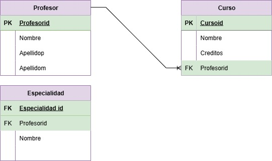

# Diccionario de la base de datos de control de cursos

1. Informacion general

| Elemento | Valor |
| :--- | :--- |
| Proyecto | Control de cursos |
| Version | 1.0 |
| Fecha | Junio 2026 |
| Elaboro | Ian Uriel Rizo Zúñiga |
| SGBD | SQL Server |

2. Descripcion del Sistema de Base de Datos

El sistema administra:
-Profesores
-Cursos
-Especialidades

Permite controlar la informacion de los profesores, los cursos que imparten y las especialidades que poseen.

3. Catalogo de restricciones utilizadas

| Código | Significado |
| :--- | :--- |
| PK | Primary Key |
| FK | Foreing |
| NN | NOT NULL |
| UQ | UNIQUE |
| AI | Auto Increment |
| CK | Check |
| DF | Default |

4. Diccionario de Datos.

## Tabla: Profesor

**Descripcion**
Almacena la informacion de los profesores.

| Campo | Tipo | Longitud | Restricciones | Descripcion |
| :--- | :--- | :--- | :--- | :--- |
| Profesorid | INT | - | PK, AI , NN | Identificador unico del profesor |
| Nombre | VARCHAR | 50 | NN | Nombre del profesor |
| Apellidop | VARCHAR | 50 | NN | Apellido paterno del profesor |
| Apellidom | VARCHAR | 50 | NN | Apellido materno del profesor |

--

## Tabla: Curso

**Descripcion**
Almacena la informacion de los cursos impartidos.

| Campo | Tipo | Longitud | Restricciones | Descripcion |
| :--- | :--- | :--- | :--- | :--- |
| Cursoid | INT | - | PK, AI , NN | Identificador unico del curso |
| Nombre | VARCHAR | 100 | UQ, NN | Nombre del curso |
| Creditos | INT | - | NN, CK(>=0) | Creditos asignados al curso |
| Profesorid | INT | - | FK, NN | Profesor que imparte el curso |

--

## Tabla: Especialidad

**Descripcion**
Almacena las especialidades de los profesores.

| Campo | Tipo | Longitud | Restricciones | Descripcion |
| :--- | :--- | :--- | :--- | :--- |
| Especialidad_id | INT | - | PK, AI , NN | Identificador unico de la especialidad |
| Profesorid | INT | - | FK, NN | Profesor al que pertenece la especialidad |
| Nombre | VARCHAR | 100 | NN | Nombre de la especialidad |

--

5. Relaciones en la Base de Datos

| Relacion | Cardinalidad | Descripcion |
| :--- | :--- | :--- |
| Profesor - Curso | 1:N | Un profesor puede impartir muchos cursos |
| Profesor - Especialidad | 1:N | Un profesor puede tener muchas especialidades |

6. Matriz de Claves Foraneas

| Tabla | Campo FK | Referencia |
| :--- | :--- | :--- |
| Curso | Profesorid | Profesor(Profesorid) |
| Especialidad | Profesorid | Profesor(Profesorid) |

7. Identidad difernecia

//Lo que permite la FK

| Codigo | Regla |
| :--- | :--- |
| IR-01 | No se puede registrar un curso con un profesor inexistente |
| IR-02 | No se puede registrar una especialidad para un profesor inexistente |
| IR-03 | No se puede eliminar un profesor que tenga cursos asociados sin antes reasignarlos o eliminarlos |
| IR-04 | No se puede eliminar un profesor que tenga especialidades asociadas sin antes reasignarlas o eliminarlas |

8. Reglas del negocio

| Codigo | Regla |
| :--- | :--- |
| RN-01 | Un profesor puede impartir varios cursos |
| RN-02 | Un curso solo puede ser impartido por un profesor |
| RN-03 | Un profesor puede tener varias especialidades |
| RN-04 | Los creditos del curso deben ser mayores o iguales a 0 |
| RN-05 | Todo curso debe estar asociado a un profesor existente |
| RN-06 | Toda especialidad debe estar asociada a un profesor existente |

9. Diagrama relacional

