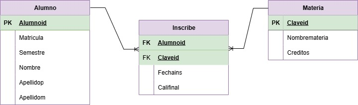

# Diccionario de la base de datos de control de inscripciones

1. Informacion general

| Elemento | Valor |
| :--- | :--- |
| Proyecto | Control de inscripciones |
| Version | 1.0 |
| Fecha | Junio 2026 |
| Elaboro | Gerardo Emmanuel Guerrero Cerón |
| SGBD | SQL Server |

2. Descripcion del Sistema de Base de Datos

El sistema administra:
-Alumnos
-Materias
-Inscripciones

Permite controlar la inscripcion de alumnos a las materias, asi como registrar la fecha de inscripcion y la calificacion final obtenida.

3. Catalogo de restricciones utilizadas

| Código | Significado |
| :--- | :--- |
| PK | Primary Key |
| FK | Foreing |
| NN | NOT NULL |
| UQ | UNIQUE |
| AI | Auto Increment |
| CK | Check |
| DF | Default |

4. Diccionario de Datos.

## Tabla: Alumno

**Descripcion**
Almacena la informacion de los alumnos.

| Campo | Tipo | Longitud | Restricciones | Descripcion |
| :--- | :--- | :--- | :--- | :--- |
| Alumnoid | INT | - | PK, AI , NN | Identificador unico del alumno |
| Matricula | VARCHAR | 10 | UQ, NN | Matricula institucional del alumno |
| Semestre | INT | - | NN, CK(>=1) | Semestre que cursa el alumno |
| Nombre | VARCHAR | 50 | NN | Nombre del alumno |
| Apellidop | VARCHAR | 50 | NN | Apellido paterno del alumno |
| Apellidom | VARCHAR | 50 | NN | Apellido materno del alumno |

--

## Tabla: Materia

**Descripcion**
Almacena la informacion de las materias.

| Campo | Tipo | Longitud | Restricciones | Descripcion |
| :--- | :--- | :--- | :--- | :--- |
| Claveid | INT | - | PK, AI , NN | Identificador unico de la materia |
| Nombremateria | VARCHAR | 100 | UQ, NN | Nombre de la materia |
| Creditos | INT | - | NN, CK(>=0) | Creditos asignados a la materia |

--

## Tabla: Inscribe

**Descripcion**
Almacena las inscripciones de los alumnos en las materias.

| Campo | Tipo | Longitud | Restricciones | Descripcion |
| :--- | :--- | :--- | :--- | :--- |
| Alumnoid | INT | - | FK, NN | Alumno inscrito |
| Claveid | INT | - | FK, NN | Materia inscrita |
| Fechains | DATE | - | NN | Fecha de inscripcion |
| Califinal | DECIMAL | 4,2 | NN, CK(>=0 AND <=10) | Calificacion final obtenida |

--

5. Relaciones en la Base de Datos

| Relacion | Cardinalidad | Descripcion |
| :--- | :--- | :--- |
| Alumno - Inscribe | 1:N | Un alumno puede tener muchas inscripciones |
| Materia - Inscribe | 1:N | Una materia puede tener muchos alumnos inscritos |

6. Matriz de Claves Foraneas

| Tabla | Campo FK | Referencia |
| :--- | :--- | :--- |
| Inscribe | Alumnoid | Alumno(Alumnoid) |
| Inscribe | Claveid | Materia(Claveid) |

7. Identidad difernecia

//Lo que permite la FK

| Codigo | Regla |
| :--- | :--- |
| IR-01 | No se puede registrar una inscripcion para un alumno inexistente |
| IR-02 | No se puede registrar una inscripcion para una materia inexistente |
| IR-03 | No se puede eliminar un alumno que tenga inscripciones asociadas sin antes eliminarlas |
| IR-04 | No se puede eliminar una materia que tenga alumnos inscritos sin antes eliminar las inscripciones |

8. Reglas del negocio

| Codigo | Regla |
| :--- | :--- |
| RN-01 | Un alumno puede inscribirse en varias materias |
| RN-02 | Una materia puede tener muchos alumnos inscritos |
| RN-03 | Un alumno no puede inscribirse dos veces en la misma materia |
| RN-04 | La calificacion final debe estar entre 0.0 y 10.0 |
| RN-05 | Toda inscripcion debe estar asociada a un alumno existente |
| RN-06 | Toda inscripcion debe estar asociada a una materia existente |

9. Diagrama relacional

