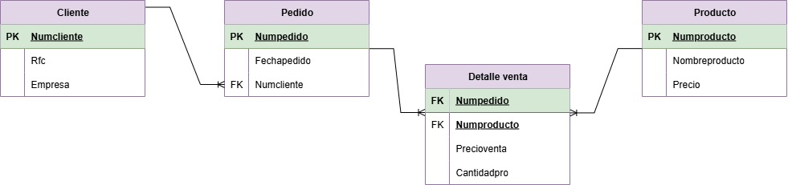

# Diccionario de la base de datos de control de ventas

1. Informacion general

| Elemento | Valor |
| :--- | :--- |
| Proyecto | Control de ventas |
| Version | 1.0 |
| Fecha | Junio 2026 |
| Elaboro | Gerardo Emmanuel Guerrero Cerón |
| SGBD | SQL Server |

2. Descripcion del Sistema de Base de Datos

El sistema administra:
-Clientes
-Pedidos
-Productos
-Detalle de venta

Permite controlar los clientes, los pedidos realizados y los productos vendidos, asi como el detalle de cada venta.

3. Catalogo de restricciones utilizadas

| Código | Significado |
| :--- | :--- |
| PK | Primary Key |
| FK | Foreing |
| NN | NOT NULL |
| UQ | UNIQUE |
| AI | Auto Increment |
| CK | Check |
| DF | Default |

4. Diccionario de Datos.

## Tabla: Cliente

**Descripcion**
Almacena la informacion de los clientes.

| Campo | Tipo | Longitud | Restricciones | Descripcion |
| :--- | :--- | :--- | :--- | :--- |
| Numcliente | INT | - | PK, AI , NN | Identificador unico del cliente |
| Rfc | VARCHAR | 13 | UQ, NN | Registro Federal de Contribuyentes del cliente |
| Empresa | VARCHAR | 100 | NN | Nombre de la empresa del cliente |

--

## Tabla: Pedido

**Descripcion**
Almacena la informacion de los pedidos realizados por los clientes.

| Campo | Tipo | Longitud | Restricciones | Descripcion |
| :--- | :--- | :--- | :--- | :--- |
| Numpedido | INT | - | PK, AI , NN | Identificador unico del pedido |
| Fechapedido | DATE | - | NN | Fecha en que se realiza el pedido |
| Numcliente | INT | - | FK, NN | Cliente que realiza el pedido |

--

## Tabla: Producto

**Descripcion**
Almacena la informacion de los productos disponibles para la venta.

| Campo | Tipo | Longitud | Restricciones | Descripcion |
| :--- | :--- | :--- | :--- | :--- |
| Numproducto | INT | - | PK, AI , NN | Identificador unico del producto |
| Nombreproducto | VARCHAR | 100 | UQ, NN | Nombre del producto |
| Precio | DECIMAL | 10,2 | NN, CK(>=0) | Precio del producto |

--

## Tabla: Detalle venta

**Descripcion**
Almacena el detalle de los productos incluidos en cada pedido.

| Campo | Tipo | Longitud | Restricciones | Descripcion |
| :--- | :--- | :--- | :--- | :--- |
| Numpedido | INT | - | FK, NN | Pedido al que pertenece el detalle |
| Numproducto | INT | - | FK, NN | Producto vendido |
| Precioventa | DECIMAL | 10,2 | NN, CK(>=0) | Precio de venta del producto |
| Cantidadpro | INT | - | NN, CK(>=1) | Cantidad de productos vendidos |

--

5. Relaciones en la Base de Datos

| Relacion | Cardinalidad | Descripcion |
| :--- | :--- | :--- |
| Cliente - Pedido | 1:N | Un cliente puede realizar muchos pedidos |
| Pedido - Detalle venta | 1:N | Un pedido puede contener muchos productos |
| Producto - Detalle venta | 1:N | Un producto puede aparecer en muchos pedidos |

6. Matriz de Claves Foraneas

| Tabla | Campo FK | Referencia |
| :--- | :--- | :--- |
| Pedido | Numcliente | Cliente(Numcliente) |
| Detalle venta | Numpedido | Pedido(Numpedido) |
| Detalle venta | Numproducto | Producto(Numproducto) |

7. Identidad difernecia

//Lo que permite la FK

| Codigo | Regla |
| :--- | :--- |
| IR-01 | No se puede registrar un pedido con un cliente inexistente |
| IR-02 | No se puede registrar un detalle de venta para un pedido inexistente |
| IR-03 | No se puede registrar un detalle de venta para un producto inexistente |
| IR-04 | No se puede eliminar un cliente que tenga pedidos asociados sin antes eliminarlos |
| IR-05 | No se puede eliminar un producto que forme parte de un detalle de venta sin antes eliminar dicho detalle |

8. Reglas del negocio

| Codigo | Regla |
| :--- | :--- |
| RN-01 | Un cliente puede realizar varios pedidos |
| RN-02 | Un pedido pertenece a un solo cliente |
| RN-03 | Un pedido puede contener varios productos |
| RN-04 | Un producto puede venderse en varios pedidos |
| RN-05 | La cantidad de productos vendidos debe ser mayor a 0 |
| RN-06 | El precio de venta debe ser mayor o igual a 0 |

9. Diagrama relacional

