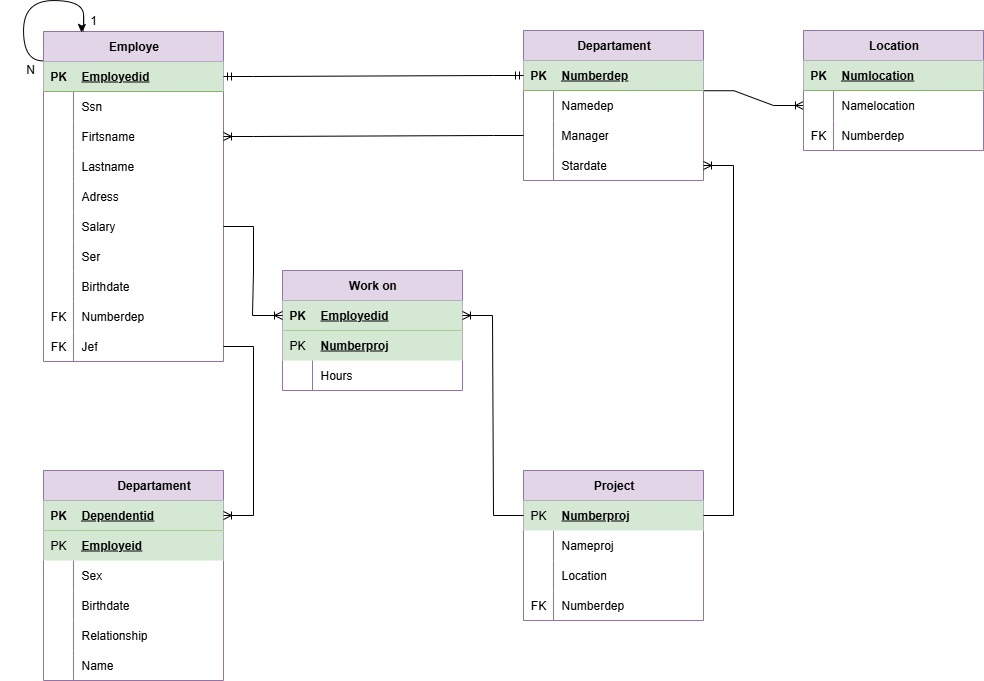

# Diccionario de la base de datos de control de empleados

1. Informacion general

| Elemento | Valor |
| :--- | :--- |
| Proyecto | Control de empleados |
| Version | 1.0 |
| Fecha | Junio 2026 |
| Elaboro | Ian Uriel Rizo Zuñiga |
| SGBD | SQL Server |

2. Descripcion del Sistema de Base de Datos

El sistema administra:
-Empleados
-Departamentos
-Ubicaciones
-Proyectos
-Dependientes
-Asignacion de proyectos

Permite controlar la informacion de los empleados, los departamentos a los que pertenecen, las ubicaciones de los departamentos, los proyectos asignados y los dependientes de cada empleado.

3. Catalogo de restricciones utilizadas

| Código | Significado |
| :--- | :--- |
| PK | Primary Key |
| FK | Foreing |
| NN | NOT NULL |
| UQ | UNIQUE |
| AI | Auto Increment |
| CK | Check |
| DF | Default |

4. Diccionario de Datos.

## Tabla: Employe

**Descripcion**
Almacena la informacion de los empleados.

| Campo | Tipo | Longitud | Restricciones | Descripcion |
| :--- | :--- | :--- | :--- | :--- |
| Employeid | INT | - | PK, AI , NN | Identificador unico del empleado |
| Ssn | VARCHAR | 20 | UQ, NN | Numero de seguro social del empleado |
| Firtsname | VARCHAR | 50 | NN | Nombre del empleado |
| Lastname | VARCHAR | 50 | NN | Apellido del empleado |
| Adress | VARCHAR | 100 | NN | Direccion del empleado |
| Salary | DECIMAL | 10,2 | NN, CK(>=0) | Salario del empleado |
| Ser | CHAR | 1 | NN | Sexo del empleado |
| Birthdate | DATE | - | NN | Fecha de nacimiento |
| Numberdep | INT | - | FK, NN | Departamento al que pertenece |
| Jef | INT | - | FK | Jefe inmediato del empleado |

--

## Tabla: Departament

**Descripcion**
Almacena la informacion de los departamentos.

| Campo | Tipo | Longitud | Restricciones | Descripcion |
| :--- | :--- | :--- | :--- | :--- |
| Numberdep | INT | - | PK, AI , NN | Identificador unico del departamento |
| Namedep | VARCHAR | 100 | UQ, NN | Nombre del departamento |
| Manager | INT | - | FK, NN | Empleado encargado del departamento |
| Stardate | DATE | - | NN | Fecha de asignacion del gerente |

--

## Tabla: Location

**Descripcion**
Almacena las ubicaciones de los departamentos.

| Campo | Tipo | Longitud | Restricciones | Descripcion |
| :--- | :--- | :--- | :--- | :--- |
| Numlocation | INT | - | PK, AI , NN | Identificador unico de la ubicacion |
| Namelocation | VARCHAR | 100 | NN | Nombre de la ubicacion |
| Numberdep | INT | - | FK, NN | Departamento al que pertenece |

--

## Tabla: Project

**Descripcion**
Almacena la informacion de los proyectos.

| Campo | Tipo | Longitud | Restricciones | Descripcion |
| :--- | :--- | :--- | :--- | :--- |
| Numberproj | INT | - | PK, AI , NN | Identificador unico del proyecto |
| Nameproj | VARCHAR | 100 | UQ, NN | Nombre del proyecto |
| Location | VARCHAR | 100 | NN | Ubicacion del proyecto |
| Numberdep | INT | - | FK, NN | Departamento responsable del proyecto |

--

## Tabla: Work on

**Descripcion**
Almacena la asignacion de empleados a los proyectos.

| Campo | Tipo | Longitud | Restricciones | Descripcion |
| :--- | :--- | :--- | :--- | :--- |
| Employeid | INT | - | PK, FK, NN | Empleado asignado |
| Numberproj | INT | - | PK, FK, NN | Proyecto asignado |
| Hours | DECIMAL | 5,2 | NN, CK(>=0) | Horas trabajadas en el proyecto |

--

## Tabla: Dependent

**Descripcion**
Almacena la informacion de los dependientes de los empleados.

| Campo | Tipo | Longitud | Restricciones | Descripcion |
| :--- | :--- | :--- | :--- | :--- |
| Dependentid | INT | - | PK, AI , NN | Identificador unico del dependiente |
| Employeid | INT | - | FK, NN | Empleado al que pertenece el dependiente |
| Sex | CHAR | 1 | NN | Sexo del dependiente |
| Birthdate | DATE | - | NN | Fecha de nacimiento |
| Relationship | VARCHAR | 30 | NN | Parentesco con el empleado |
| Name | VARCHAR | 100 | NN | Nombre del dependiente |

--

5. Relaciones en la Base de Datos

| Relacion | Cardinalidad | Descripcion |
| :--- | :--- | :--- |
| Departament - Employe | 1:N | Un departamento tiene muchos empleados |
| Employe - Employe | 1:N | Un empleado puede ser jefe de varios empleados |
| Departament - Location | 1:N | Un departamento puede tener muchas ubicaciones |
| Departament - Project | 1:N | Un departamento administra muchos proyectos |
| Employe - Work on | 1:N | Un empleado puede trabajar en varios proyectos |
| Project - Work on | 1:N | Un proyecto puede tener varios empleados asignados |
| Employe - Dependent | 1:N | Un empleado puede tener muchos dependientes |

6. Matriz de Claves Foraneas

| Tabla | Campo FK | Referencia |
| :--- | :--- | :--- |
| Employe | Numberdep | Departament(Numberdep) |
| Employe | Jef | Employe(Employeid) |
| Departament | Manager | Employe(Employeid) |
| Location | Numberdep | Departament(Numberdep) |
| Project | Numberdep | Departament(Numberdep) |
| Work on | Employeid | Employe(Employeid) |
| Work on | Numberproj | Project(Numberproj) |
| Dependent | Employeid | Employe(Employeid) |

7. Identidad difernecia

//Lo que permite la FK

| Codigo | Regla |
| :--- | :--- |
| IR-01 | No se puede registrar un empleado con un departamento inexistente |
| IR-02 | No se puede asignar un jefe inexistente a un empleado |
| IR-03 | No se puede registrar una ubicacion para un departamento inexistente |
| IR-04 | No se puede registrar un proyecto para un departamento inexistente |
| IR-05 | No se puede asignar un empleado a un proyecto inexistente |
| IR-06 | No se puede registrar un dependiente para un empleado inexistente |
| IR-07 | No se puede eliminar un departamento que tenga empleados, proyectos o ubicaciones asociadas sin antes reasignarlos o eliminarlos |

8. Reglas del negocio

| Codigo | Regla |
| :--- | :--- |
| RN-01 | Un empleado pertenece a un solo departamento |
| RN-02 | Un departamento puede tener muchos empleados |
| RN-03 | Un empleado puede trabajar en varios proyectos |
| RN-04 | Un proyecto puede tener varios empleados asignados |
| RN-05 | Un empleado puede tener muchos dependientes |
| RN-06 | Un empleado puede ser jefe de varios empleados |
| RN-07 | Las horas trabajadas deben ser mayores o iguales a 0 |
| RN-08 | El salario del empleado debe ser mayor o igual a 0 |

9. Diagrama relacional

